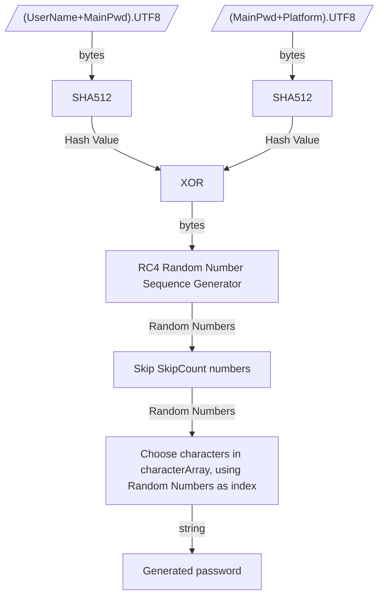

# PwdGen
* This is a password generator and manager.

## Purpose
* Generate strong password by simple string.
* Generate different passwords by the same string.

## Usage
1. Choose a simple password as Main Password.
2. Click the Add button in the top left corner.
3. Fill in the form. User Name is account name, Platform is the platform of the account, for example, gmail.
4. Click Save button in the top right corner.
5. You can see your account info in main page. Click Detail button.
6. Input your Main Password and click Gen, you will see a string show up. It is the generated password and you can use it as the password for your account.

## Caveat
* The generated password is related to the User Name, Platform, Skip Count and Main Password.
* Remember your Main Password. Main Password will not be saved.
* You can backup and restore data in settings.

## Data Flow (substandard)

