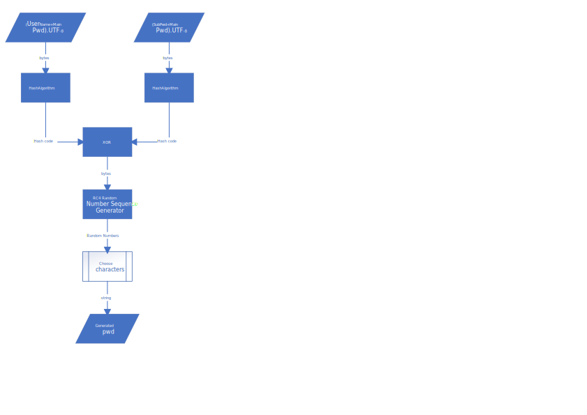

# PwdGen
* This is a password generator and password manager.

# Purpose
* Generate strong password by simple string.
* Generate different passwords by the same string.

## Usage
1. Choose a simple password as main password.
1. Click the navigation bar, choose UserAccts, click create.
1. Fill in the form.Username is account name, Sub-Password is the company of the account.
1. Click Generate and a string show up.It is generated password and you can use it as the password for your account.
1. Remember main password and click Save.Main password will not be saved.

## Caveat
* The generated password is related to the username, sub-password and main password.
* You can backup and restore data in settings.

## Data Flow(substandard)

